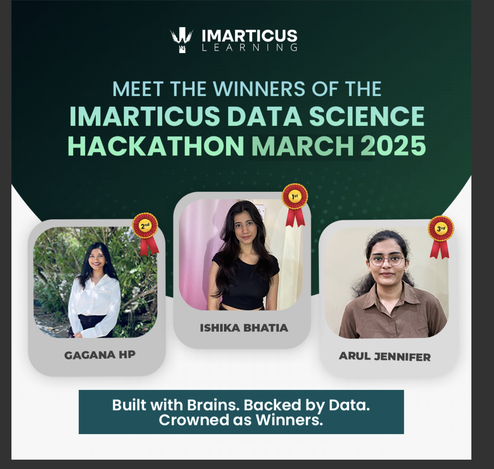

<h1 align="center">Hi 👋, I'm Arul Jennifer</h1>

<h3 align="center">Data Science Enthusiast | Unlocking Insights from Data | Based in India</h3>

 

- 🏆 I recently secured **3rd Place** in **Imarticus Hackathon** (Data Science Challenge)

- 🔭 I’m currently working on *Data Analysis and Machine Learning Projects*

- 🌱 I’m currently learning *Advances Machine Learning*

- 👯 I’m looking to collaborate on *Data Analytics Projects*

- 🤝 I’m looking for help with *Building Real-Time Data Applications*

- 💬 Ask me about *SQL, Python, Machine Learning, Power BI, Streamlit*

- 📫 How to reach me: *aruljennifer2000@gmail.com*

- 👨‍💻 All of my projects are available at [https://aruljennifer2000.wixsite.com/my-site-6](https://aruljennifer2000.wixsite.com/my-site-6)

<h3 align="left">Connect with me:</h3>

<h3 align="left">Languages and Tools:</h3>

